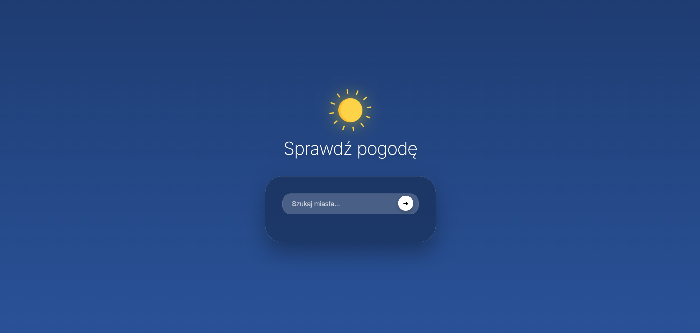
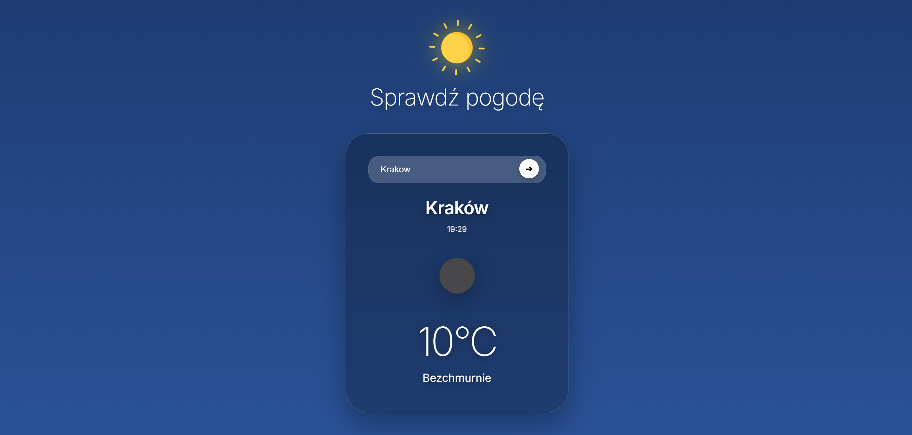

# 🌦️ AWS Serverless Weather App (HTTPS)

  
  

**AWS Serverless Weather App** is a professional, production-ready weather application built on an **Event-Driven Serverless Architecture**. This project demonstrates modern cloud infrastructure practices, Infrastructure as Code (IaC), and a _Security-First_ approach to frontend development.

## 🚀 Live Demo

👉👉 **[Launch Interactive Weather Dashboard](https://d1wcur5pv05klp.cloudfront.net)**

> **Infrastructure Note:** This application is fully automated and hosted on **AWS**.
> The entire environment is deployed using **AWS SAM (Serverless Application Model)**, including:
>
> - **Amazon S3** for static asset hosting.
> - **Amazon CloudFront** as a global CDN with SSL/TLS encryption.
> - **AWS Lambda & API Gateway** providing a scalable, serverless backend.

---

## ✨ Key Features

- 🌍 **Global Content Delivery:** Instant access worldwide via CloudFront's edge locations.
- 🔐 **Security Hardening:** Proactive input sanitization (Regex) and robust XSS prevention.
- 🏗️ **Infrastructure as Code (IaC):** Repeatable and secure stack deployment with a single command.
- 📱 **Modern UI:** Responsive "Glassmorphism" design with smooth CSS3 animations and iOS-inspired styling.
- ⚡ **High Performance:** A "No Ops" approach – scaling automatically based on traffic demand.

---

## 🛠️ Tech Stack & Tools

- **Cloud (AWS):** Lambda, S3, CloudFront, API Gateway, IAM.
- **Backend:** Python 3.13 (Optimized for low cold-starts and high performance).
- **Frontend:** Vanilla JS (ES6+), HTML5, CSS3 (BEM methodology).
- **Security:** HTTPS Enforcement, Input Sanitization, `encodeURIComponent` logic.
- **DevOps:** AWS SAM CLI, Git Flow (Feature Branching).

---

## 🏗️ Architecture & Optimization

### 🚀 Performance & Security Tuning

- **CloudFront Invalidation:** Automated CDN cache clearing during frontend updates.
- **XSS Prevention:** Zero reliance on `.innerHTML`; utilizing `.textContent` for all dynamic user-facing data.
- **API Hygiene:** Implementation of `encodeURIComponent` to safely pass city names to the backend.
- **Optimization:** Leveraging a lightweight Python 3.13 runtime in Lambda to reduce latency and execution costs.

---

## 📸 Screenshots

|       Main Dashboard       |          Search & Validation           |
| :------------------------: | :------------------------------------: |
|  |  |
|  **Main UI (iOS Style)**   |       **Security & Validation**        |

---

## 🚀 Getting Started

### ⚠️ Environment Variables (CRITICAL)

The application requires an OpenWeather API key. For local testing, prepare a `locals.json` file:

```json
{
  "WeatherFunction": {
    "OPENWEATHER_API_KEY": "your_secret_key"
  }
}
```

### Option A: Running with AWS SAM (Production)

1.  **Build application:**

    ```bash
    sam build
    ```

2.  **Deploy to AWS:**

    ```bash
    sam deploy --guided
    ```

3.  **Sync Static Files to S3:**
    ```bash
    aws s3 sync ./static s3://your-bucket-name --delete
    ```

### Option B: Local Development & Testing

1.  **Run API locally:**

    ```bash
    sam local start-api --env-vars locals.json
    ```

2.  **Sanity Check (XSS Test):**
    Enter `` into the search field to verify security filters.

---

## 🔮 Future Roadmap

- [ ] **5-Day Forecast:** Extending the backend to provide long-term weather data.
- [ ] **Geolocation:** Implementing automatic browser-based location detection.
- [ ] **Lambda@Edge:** Moving validation logic directly to the CDN edge for even lower latency.

---

## ⚖️ License

This project is licensed under the MIT License - see the [LICENSE](LICENSE) file for details.

---

**Author:** Mateusz (pucio8)  
**Project Status:** Functional Prototype / Production Ready
